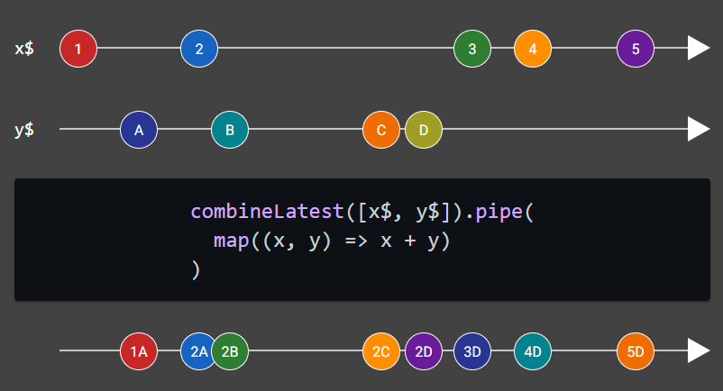

# RxJS Marbles

[](https://github.com/Tommy228/rxjs-marbles/actions/workflows/actions.yml)

RxJS Marbles is a website that helps you see and learn about RxJS operators in an interactive way.

It is a rewrite of the [rxmarbles](https://github.com/staltz/rxmarbles) project, which has not been maintained since 2021.

## Features



* Visualize example diagrams for some RxJS operators.
* Drag items on a timeline to observe how operators work.
* Easily share diagrams with direct links, such as https://rxjsmarbles.dev/debounceTime.

## Getting started

Clone the repository then simply run

```bash
npm install
npm start
```

## License

This project is licensed under the MIT License - see the [LICENSE](LICENSE) file for details.


